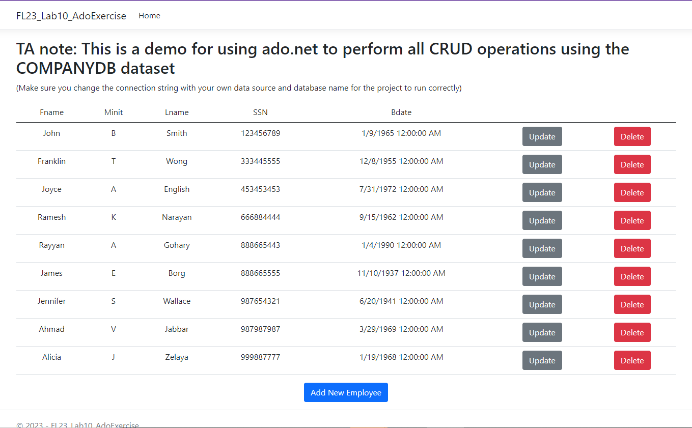
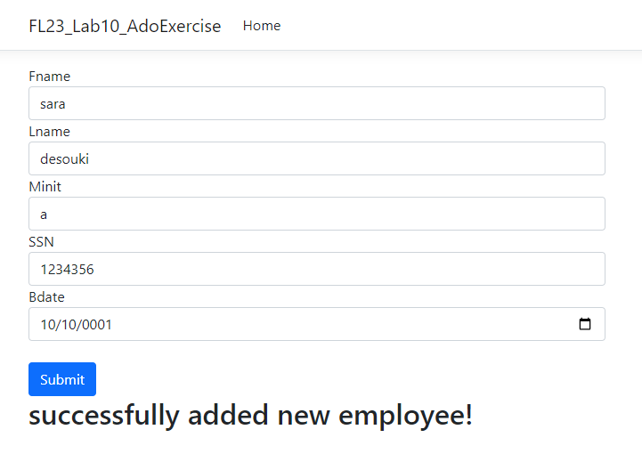
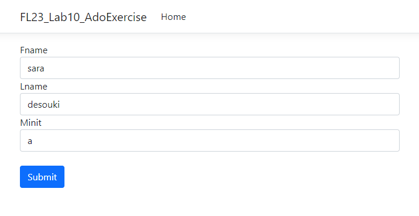
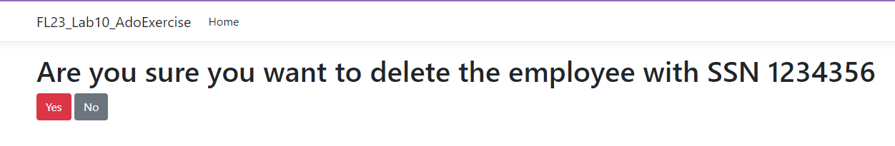

## An implementation of Ado.net inside Razor Pages using the COMPANYDB dataset

> Intended for: CSAI202 and CIE206 students, FL23, ZewailCity

### Screenshots
#### Get All Employees (Index.cshtml)

#### Add Employee (Create.cshtml)

#### Update Employee (Update.cshtml)

#### Delete Employee (Delete.cshtml)

